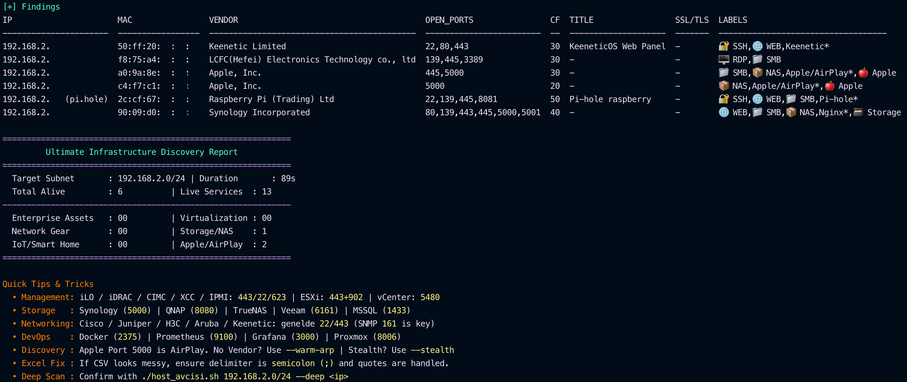

<p align="left">

</p>

[](#)
[](#)
[](#)
[](#)
[](#)
[](#)

**host-avcisi**, yüksek hızlı, çok motorlu bir ağ keşif ve altyapı analiz aracıdır. Sistem yöneticileri ve güvenlik araştırmacıları için bir yardımcı program olarak tasarlanmıştır. Modern tarayıcıların hızını, derinlemesine istihbarat toplama yeteneğiyle birleştirerek yerel ağınızın eksiksiz bir görünümünü sunar.

---

## Öne Çıkan Özellikler

- **Çoklu Motor Çekirdeği**: `naabu` (SYN taraması), `rustscan` (ekstrem hız) ve `nmap` (güvenilir fallback) arasında sorunsuz geçiş yapın.
- **Profesyonel Özet Paneli**: Tarama sonrası ağ varlıklarınızı **IoT, Kurumsal, Sanallaştırma, Depolama ve Ağ Ekipmanları** olarak kategorize eden şık bir rapor sunar.
- **Akıllı Etiketleme**: Görsel simgelerle otomatik tanımlama:
  - **iLO/IPMI** | 🍎 **Apple/AirPlay** | 🏗️ **Kurumsal Servis**
  - **NAS/Depolama** | 📹 **CCTV** | 🧊 **Sanallaştırma (ESXi/Proxmox)**
- **Derin İstihbarat**: Web başlıklarını, teknolojileri ve SSL/TLS Sertifika detaylarını otomatik olarak çıkarmak için `httpx` ile entegre çalışır.
- **Stealth (Gizli) Mod**: Gürültüyü en aza indirmek için ARP önbellek analizi ve rastgele, yanıltıcı (decoy) paketler kullanan sessiz host keşfi.
- **İlerleme Göstergesi**: Taramanın hangi aşamada olduğunu, yüzde ilerlemesini ve geçen süreyi gösteren gerçek zamanlı progress bar.
- **Bildirim Desteği**: Tarama tamamlandığında macOS ve Linux'ta masaüstü bildirimi (`--notify`).
- **Gizlilik Bilgisi**: Gizli veya özel cihazlar konusunda sizi uyarmak için "Randomize MAC Adreslerini" (LAA) sarı renkte tespit eder.
- **Dışa Aktarılabilir**: Doğrudan Masaüstünüze Excel uyumlu tek tıkla CSV çıktısı verir.

---

## Kurulum

Sisteminizde temel bağımlılıkların kurulu olduğundan emin olun:

```bash
# Genel gereksinimler
brew install nmap naabu rustscan httpx python3
```

---

## Kullanım

### Temel Tarama

En önemli 38 portun hızlı keşfi:

```bash
sudo ./host_avcisi.sh 192.168.1.0/24 --warm-arp
```

### Gizli Keşif

ARP tablosu ve yavaş, rastgele sondalar kullanarak maksimum sessizlik:

```bash
./host_avcisi.sh --stealth --warm-arp 10.0.0.0/24
```

### Derinlemesine Analiz

Belirli bir hedef için yoğun versiyon tespiti ve script taraması:

```bash
./host_avcisi.sh --deep 192.168.1.50 --save
```

---

## Gizli Tarama (Stealth Mode) Detayları

`host-avcisi`, ağda iz bırakmamak veya güvenlik duvarlarını/IDS sistemlerini tetiklememek için gelişmiş bir gizlilik mimarisi kullanır:

1.  **Ping Sweep Atlanması**: Klasik ağ tarayıcılarının aksine, tüm ağa gürültülü ICMP paketleri göndermez. Bu sayede ağ yöneticilerinin monitörlerinde "kırmızı alarm" oluşmasını engeller.
2.  **ARP Tabanlı Keşif**: Host keşfi için yerel makinenin ARP tablosuna güvenilir. Bu, ağ trafiği üretmeden, cihazın zaten bildiği komşularını sessizce listelemesini sağlar.
3.  **Akıllı ve Rastgele Dürtme (Probe)**: Eğer `--warm-arp` ile beraber kullanılırsa;
    - IP adreslerini sıralı değil, **karışık (randomized)** bir düzende yoklar.
    - Paketleri parçalara ayırır (**IP Fragmentation** `-f`) ve sahte IP adresleriyle (**Decoy** `-D RND:10`) karıştırarak gerçek kaynağı gizler.
    - Taramayı çok yavaş (`-T2` polite timing) ve insani hızlarda yaparak imza tabanlı tespitlerden kaçınır.

---

## Seçenekler

| Flag (Bayrak)  | Açıklama                                                              |
| -------------- | --------------------------------------------------------------------- |
| `--engine`     | Tarama motorunu zorla: `auto`, `naabu`, `rustscan` veya `nmap`        |
| `--warm-arp`   | Daha iyi MAC/Vendor tespiti için yerel ARP önbelleğini uyandırır      |
| `--stealth`    | Parçalanmış paketler ve yanıltıcı IP'lerle gizli modu etkinleştirir   |
| `--rate`       | Tarama hızını ayarlar (varsayılan: 3000)                              |
| `--no-intel`   | httpx başlık ve teknoloji toplama adımını atlar                       |
| `--ports`      | Özel port listesi (örn: `--ports 22,80,443,8080`)                     |
| `--save`       | Sonuçları Masaüstüne Excel uyumlu CSV olarak kaydeder                 |
| `--deep <ip>`  | Belirli bir IP için derinlemesine nmap versiyon/script taraması yapar |
| `--update-oui` | Yerel IEEE MAC Vendor veritabanını günceller                          |

---

## Örnek Çıktı



Araç, okunabilirliğe odaklanan temiz ve otomatik hizalanmış bir tablo sunar.

---

## Gereksinimler

- **macOS / Linux**
- **Sudo Yetkileri** (SYN taramaları ve ARP yönetimi için gereklidir)
- **Nmap**, **Naabu** veya **Rustscan**
- **httpx** (İstihbarat özellikleri için)

---

## Katkıda Bulunma

**[Göktuğ Örgün](https://github.com/goktugorgn)** tarafından geliştirilmiştir.

Geri bildirimler, sorun bildirimleri ve katkılar serbest :)
